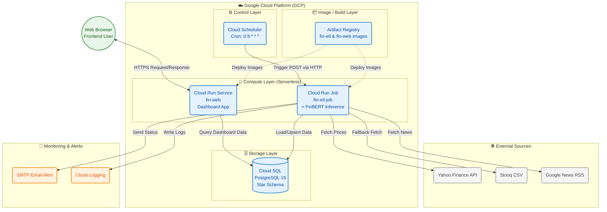

# บทที่ 3
# วิธีการดำเนินการวิจัย (Research Methodology)

การวิจัยครั้งนี้เป็นการวิจัยและพัฒนา (Research and Development: R&D) ที่มุ่งเน้นการออกแบบ พัฒนา และทดสอบระบบซอฟต์แวร์จริง โดยใช้กระบวนการพัฒนาแบบ Iterative ซึ่งทดสอบและปรับปรุงระบบในทุกๆ ขั้นตอนของการพัฒนา การดำเนินงานแบ่งออกเป็น 5 ขั้นตอนหลักดังต่อไปนี้

---

## 3.1 การออกแบบสถาปัตยกรรมระบบโดยรวม (Overall System Architecture)

ก่อนเริ่มพัฒนา ผู้วิจัยได้ออกแบบสถาปัตยกรรมของระบบทั้งหมดโดยคำนึงถึงหลักการสำคัญ 3 ประการ ได้แก่

1. **Separation of Concerns:** แยกส่วนประมวลผล (ETL) ออกจากส่วนแสดงผล (Web Dashboard) เพื่อให้สามารถพัฒนา ทดสอบ และปรับขนาดได้อย่างอิสระ
2. **Fault Tolerance:** ออกแบบให้ระบบยังทำงานได้แม้แหล่งข้อมูลหลักล้มเหลว โดยมีกลไก Fallback (Yahoo Finance → Stooq)
3. **Serverless-First:** เลือกใช้บริการ Managed Services บน GCP เพื่อลดภาระการบริหารจัดการโครงสร้างพื้นฐาน

สถาปัตยกรรมของระบบประกอบด้วย 4 Layer หลักดังภาพต่อไปนี้

---

> **[รูปที่ 3.1]** แผนภาพ System Architecture Diagram ทั้งระบบ (GCP Workflow / Deployment)
> 📸 **คำแนะนำสำหรับแคปรูป:** ก๊อปปี้โค้ดด้านล่างนี้ไปวางใน [Mermaid Live Editor](https://mermaid.live) แล้วเซฟเป็นรูปภาพใส่ได้เลยครับ



---

## 3.2 การพัฒนาระบบ ETL Pipeline

### 3.2.1 โมดูลสกัดข้อมูลราคาสินทรัพย์ (Price Extraction Module)

ระบบกำหนดสินทรัพย์เป้าหมายทั้งหมด 7 รายการผ่าน Environment Variable `TICKERS` ครอบคลุมสินทรัพย์ 4 ประเภทเพื่อความหลากหลายในการวิเคราะห์

| Ticker | ชื่อสินทรัพย์ | ประเภท |
|---|---|---|
| AAPL | Apple Inc. | หุ้น US (Stocks) |
| TSLA | Tesla Inc. | หุ้น US (Stocks) |
| MSFT | Microsoft Corp. | หุ้น US (Stocks) |
| BTC-USD | Bitcoin | คริปโทเคอร์เรนซี (Crypto) |
| EURUSD=X | EUR/USD | อัตราแลกเปลี่ยน (Forex) |
| THBUSD=X | THB/USD | อัตราแลกเปลี่ยน (Forex) |
| GC=F | Gold Futures | สินค้าโภคภัณฑ์ (Commodity) |

โมดูลดึงข้อมูลราคาผ่านไลบรารี `yfinance` โดยดึงข้อมูลย้อนหลัง 14 วัน (`lookback_days=14`) เพื่อรองรับกรณีที่มีวันหยุดตลาดหลายวันต่อเนื่อง ข้อมูลราคาที่ดึงมาได้แก่ OHLCV (Open, High, Low, Close, Volume) และ Adj Close สำหรับการปรับราคาหลังจ่ายปันผล

กรณีที่ Yahoo Finance ไม่ตอบสนองหรือคืนข้อมูลว่างเปล่า ระบบจะ Fallback ไปยัง Stooq โดยอัตโนมัติ ซึ่งเป็นบริการข้อมูลราคาสำรองที่ไม่มีข้อจำกัดเรื่อง Rate Limit

**กระบวนการ Cleansing ข้อมูลราคา:**
- Rename Column Headers จาก `Open, High, Low, Close, Adj Close` เป็น `open, high, low, close, adj_close` ตามมาตรฐาน Snake_case ของฐานข้อมูล
- แปลง Column วันที่จาก `Date` เป็น `d` ในรูปแบบ `datetime.date` ที่ไม่มี Timezone
- ลบแถวที่ค่าราคา Close เป็น NaN ออก (อาจเกิดจากวันหยุดหรือ Delistiment)
- คำนวณ `return_1d = (close_t - close_{t-1}) / close_{t-1}` และ `pct_change = return_1d × 100`

### 3.2.2 โมดูลสกัดข้อมูลข่าว (News Extraction Module)

ระบบดึงข่าวจาก Google News RSS Feed โดยสร้าง URL ค้นหาแบบ Dynamic สำหรับแต่ละ Ticker เพื่อรับประกันว่าข่าวที่ดึงมาตรงกับสินทรัพย์เป้าหมาย โดยเฉพาะ Ticker ที่ชื่อสัญลักษณ์ไม่ตรงกับชื่อที่ใช้ค้นหาข่าว เช่น `GC=F` ซึ่งถ้าค้นหาตรงๆ จะไม่พบข่าวที่เกี่ยวข้อง ระบบจึงมีการ Map Ticker กับ Search Term พิเศษ ดังนี้

```python
# src/config.py
_DEFAULT_TICKER_SEARCH_TERMS = {
    "GC=F":     "gold price USD",
    "EURUSD=X": "euro dollar exchange rate",
    "THBUSD=X": "Thai baht USD exchange rate",
    "BTC-USD":  "Bitcoin USD price",
}
```

**URL Pattern ที่ใช้:**
```
https://news.google.com/rss/search?q={search_term}%20market&hl=en-US&gl=US&ceid=US:en
```

**กระบวนการ Cleansing ข้อมูลข่าว:**
1. **Time Filtering:** ใช้ `LOOKBACK_HOURS = 168` กรองเฉพาะข่าวภายใน 7 วันล่าสุด ป้องกันการนำข่าวเก่าที่ตลาดย่อยรับรู้ไปแล้วมาวิเคราะห์
2. **Source Credibility Filtering:** กรองเฉพาะข่าวจากแหล่งที่อยู่ใน Trusted Sources List เช่น Bloomberg, Reuters, CNBC, Yahoo Finance, Seeking Alpha เพื่อลด Noise จากบทความ Blog หรือเว็บที่ไม่น่าเชื่อถือ
3. **Timestamp Normalization:** แปลงวันและเวลาเผยแพร่ทุกรูปแบบ (RFC 2822, ISO 8601) ให้เป็น UTC Timezone เสมอ
4. **Deduplication:** สร้าง `news_hash = SHA256(ticker + published_at + title + url)` เพื่อเป็น Unique Identifier ของข่าวแต่ละชิ้น ถ้า Hash ซ้ำ Database จะปฏิเสธการ Insert โดย UNIQUE Constraint โดยอัตโนมัติ

### 3.2.3 โมดูลวิเคราะห์ Sentiment ด้วย FinBERT (Transform Module)

เป็นขั้นตอนที่ซับซ้อนและใช้ทรัพยากรสูงที่สุดในไปป์ไลน์ โดยโหลดโมเดล `ProsusAI/finbert` จาก HuggingFace Hub และ Tokenizer มาไว้บน RAM ตั้งแต่เริ่มต้นโปรแกรม (Load Once)

**ขั้นตอนการ Inference FinBERT สำหรับข่าวทุกชิ้น:**

```
Input: "Apple Reports Record Q1 Earnings, Stock Surges 5%"
         ↓
    WordPiece Tokenizer
         ↓
Token IDs: [101, 6207, 7292, 2501, 2275, 1053, 1016, 22578, ..., 102]
         ↓
    FinBERT Encoder (12 Transformer Layers)
         ↓
Logits: [positive=2.83, negative=-1.74, neutral=0.21]
         ↓
    Softmax
         ↓
Probabilities: [P(pos)=0.89, P(neg)=0.04, P(neu)=0.07]
         ↓
sentiment_score = P(pos) - P(neg) = 0.89 - 0.04 = 0.85
sentiment_label = "positive"
```

**การสร้าง Sentiment Index รายวัน:**
หลังจากวิเคราะห์ข่าวทุกชิ้นแล้ว ระบบจะรวม Sentiment Score ของข่าวทั้งหมดในแต่ละวันและแต่ละ Ticker เพื่อสร้าง Daily Sentiment Index โดยคำนวณค่าเฉลี่ย (Mean) ของ `sentiment_score` ทั้งหมดพร้อมนับจำนวนข่าว Positive, Negative, Neutral แล้วบันทึกลงตาราง `fact_sentiment_daily`

### 3.2.4 โมดูลโหลดข้อมูล (Load Module)

ระบบโหลดข้อมูลทั้งหมดผ่าน SQLAlchemy ORM และใช้กลยุทธ์ต่างกันตามลักษณะของข้อมูล:

| ตาราง | กลยุทธ์ | เหตุผล |
|---|---|---|
| `fact_price_daily` | UPSERT (`ON CONFLICT DO UPDATE`) | ราคาอาจมีการแก้ไขย้อนหลังได้ |
| `fact_news` | INSERT ถ้า `news_hash` ไม่ซ้ำ | ข่าวไม่เปลี่ยนแปลง แค่ป้องกันซ้ำ |
| `fact_sentiment_daily` | UPSERT | Sentiment Index ถูกคำนวณใหม่เสมอ |
| `dim_asset / dim_source / dim_date` | UPSERT (`ON CONFLICT DO NOTHING`) | Dimension ไม่ค่อยเปลี่ยนแปลง |

ก่อน Load ข้อมูล Fact ใดๆ ระบบจะ Ensure Dimension Tables ก่อนเสมอ เพื่อป้องกัน Foreign Key Constraint Violation:
```
ensure_dim_dates() → ensure_assets() → ensure_sources()
→ upsert_price_daily() → insert_news() → upsert_daily_sentiment()
```

### 3.2.5 ระบบตรวจสอบคุณภาพข้อมูล (Data Quality Checks)

หลังจากโหลดข้อมูลเสร็จทุกครั้ง ระบบจะรัน DQ Check อัตโนมัติผ่านโมดูล `src/dq/checks.py` เพื่อตรวจสอบความสมบูรณ์ของข้อมูลก่อนส่ง Email Alert ผลลัพธ์ DQ Check (`Pass/Fail`) จะถูกส่งรวมไปใน Email รายงานประจำวัน

---

## 3.3 การออกแบบฐานข้อมูล (Database Design)

### 3.3.1 โครงสร้างฐานข้อมูลแบบ Star Schema

เพื่อตอบสนองต่อลักษณะของข้อมูลที่มีปริมาณมากและต้องการนำไปแสดงผลบน Dashboard อย่างรวดเร็ว (OLAP Workload) ระบบบัญชีข้อมูล (`fin_dw`) บน Cloud SQL จึงถูกออกแบบโดยใช้หลักการ **Star Schema**

**จุดประสงค์ของการใช้ Star Schema ในโครงงานนี้:**
1. **เพิ่มประสิทธิภาพการ Query ข้อมูล (Performance):** ลดการ Join ตารางที่ซับซ้อน ทำให้ Web Dashboard สามารถดึงข้อมูลจำนวนมาก (Aggregated Data) ไปพล็อตกราฟได้อย่างรวดเร็วในระดับหลักมิลลิวินาที
2. **แยกมิติและข้อเท็จจริงชัดเจน (Separation of Data):** แยกข้อมูลที่เป็นตัวเลขเชิงปริมาณ เช่น ราคาหุ้น หรือ คะแนน Sentiment ไว้ใน **Fact Tables** และแยกข้อมูลเชิงบรรยายที่จะใช้เป็นตัวกรอง (Filters) ไว้ใน **Dimension Tables** 
3. **รองรับการขยายตัว (Scalability):** หากในอนาคตต้องการเพิ่มสินทรัพย์ (Asset) แนวใหม่ โครงสร้างนี้สามารถรองรับได้ทันทีโดยไม่ต้องแก้โครงสร้างตารางหลัก

**ขั้นตอนการออกแบบและสร้าง Star Schema:**
1. **การวิเคราะห์ Business Process:** กำหนดว่าระบบต้องการวัดผลอะไร (Metrics) ซึ่งในที่นี้คือ ราคาเปิด/ปิดประจำวัน, เปอร์เซ็นต์การเปลี่ยนแปลงของราคา, และดัชนีความรู้สึก (Sentiment Index)
2. **การกำหนด Granularity:** กำหนดระดับความละเอียดของข้อมูล โดยให้ข้อมูลราคามีความละเอียดระดับ "รายวัน" (Daily) และข้อมูลข่าวมีความละเอียดระดับ "รายชิ้นข่าว" (Per Article)
3. **การออกแบบ Dimension Tables:** สร้างมิติข้อมูลเพื่อใช้มุมมองในการวิเคราะห์ ได้แก่ `dim_asset` (สินทรัพย์), `dim_source` (แหล่งข่าว), และ `dim_date` (มิติเวลา)
4. **การออกแบบ Fact Tables:** สร้างตารางเก็บข้อเท็จจริง ได้แก่ `fact_price_daily` (ราคารายวัน), `fact_news` (ข่าวรายชิ้น), และ `fact_sentiment_daily` (สรุปความรู้สึกรายวัน)

---

> **[รูปที่ 3.2]** แผนภาพ Entity-Relationship (ER) Diagram ของ Star Schema 
> 📸 **คำแนะนำสำหรับแคปรูป:** 
> 1. ไปที่เว็บไซต์ https://dbdiagram.io/ และวางโค้ด SQL DDL ลงไปเพื่อให้เว็บวาดความสัมพันธ์โยงเส้นให้อัตโนมัติ 
> 2. หรือแคปหน้าจอโครงสร้างตารางจากโปรแกรม DBeaver / pgAdmin โดยให้ตาราง Fact อยู่ตรงกลาง และ Dimension ล้อมรอบเป็นรูปดาว

---

โครงสร้างสคริปต์ DDL (Data Definition Language) ที่สำคัญในการสร้าง Schema มีดังต่อไปนี้:

**Dimension Tables:**
ตารางมิติข้อมูล (Dimension Tables) ทำหน้าที่เก็บข้อมูลเชิงบริบทที่ไม่ค่อยมีการเปลี่ยนแปลง

```sql
-- dim_asset: เก็บข้อมูลมิติของสินทรัพย์ (เช่น หุ้น, ทองคำ, อัตราแลกเปลี่ยน)
CREATE TABLE IF NOT EXISTS dim_asset (
  asset_id    SERIAL PRIMARY KEY,
  ticker      TEXT NOT NULL UNIQUE,
  asset_name  TEXT,
  asset_class TEXT,       -- แยกประเภทกลุ่มสินทรัพย์
  currency    TEXT,
  exchange    TEXT,
  created_at  TIMESTAMPTZ DEFAULT now()
);

-- dim_source: เก็บข้อมูลมิติของแหล่งข่าวเพื่อวิเคราะห์ความน่าเชื่อถือ
CREATE TABLE IF NOT EXISTS dim_source (
  source_id       SERIAL PRIMARY KEY,
  source_name     TEXT NOT NULL,
  source_type     TEXT NOT NULL DEFAULT 'rss',
  base_url        TEXT,
  credibility_score NUMERIC(3,1) DEFAULT 5.0,
  UNIQUE (source_name, source_type)
);

-- dim_date: ปฏิทินกลางสำหรับวิเคราะห์ข้อมูลข้ามตาราง (Time-series)
CREATE TABLE IF NOT EXISTS dim_date (
  d         DATE PRIMARY KEY,
  y         INT NOT NULL,  -- ปี
  m         INT NOT NULL,  -- เดือน
  day       INT NOT NULL,  -- วัน
  dow       INT NOT NULL,  -- วันในสัปดาห์ 
  is_weekend BOOLEAN NOT NULL
);
```

**Fact Tables:**
ตารางข้อเท็จจริง (Fact Tables) ทำหน้าที่เก็บข้อมูลธุรกรรมและตัวเลขชี้วัด โดยชี้ Foreign Key กลับไปยัง Dimension

```sql
-- fact_price_daily: เก็บข้อเท็จจริงของราคาและผลตอบแทนรายวัน
CREATE TABLE IF NOT EXISTS fact_price_daily (
  asset_id   INT NOT NULL REFERENCES dim_asset(asset_id),
  d          DATE NOT NULL REFERENCES dim_date(d),
  open       NUMERIC, high  NUMERIC, low   NUMERIC,
  close      NUMERIC, adj_close NUMERIC,
  volume     BIGINT,
  return_1d  NUMERIC,  -- ผลตอบแทนรายวันคำนวณจาก (close_t - close_{t-1})/close_{t-1}
  pct_change NUMERIC,  
  PRIMARY KEY (asset_id, d)
);

-- fact_news: เก็บข้อเท็จจริงของข่าวแต่ละชิ้น (Granularity ระดับ Article)
CREATE TABLE IF NOT EXISTS fact_news (
  news_id         BIGSERIAL PRIMARY KEY,
  asset_id        INT NOT NULL REFERENCES dim_asset(asset_id),
  source_id       INT NOT NULL REFERENCES dim_source(source_id),
  published_at    TIMESTAMPTZ NOT NULL,
  published_d     DATE NOT NULL REFERENCES dim_date(d),
  title           TEXT NOT NULL,
  url             TEXT,
  news_hash       TEXT NOT NULL UNIQUE,  -- MD5 Hash ป้องกันข่าวซ้ำ
  sentiment_score NUMERIC,   -- ค่า Sentiment Score จาก FinBERT [-1, 1]
  sentiment_label TEXT       -- 'positive' | 'negative' | 'neutral'
);

-- fact_sentiment_daily: เก็บข้อเท็จจริงดัชนีความรู้สึกรวมรายวัน
CREATE TABLE IF NOT EXISTS fact_sentiment_daily (
  asset_id         INT NOT NULL REFERENCES dim_asset(asset_id),
  d                DATE NOT NULL REFERENCES dim_date(d),
  news_count       INT NOT NULL,
  sentiment_mean   NUMERIC, -- ค่าดัชนีความรู้สึก (Sentiment Index)
  pos_count        INT NOT NULL,
  neu_count        INT NOT NULL,
  neg_count        INT NOT NULL,
  PRIMARY KEY (asset_id, d)
);
```

### 3.3.2 Analytical View

นอกจาก Table หลักแล้ว ระบบยังสร้าง **Database View** ชื่อ `vw_daily_asset_metrics` เพื่อรวมข้อมูลจากหลายตารางไว้ในที่เดียว ลดความซับซ้อนของ Query ใน Web Dashboard

```sql
CREATE OR REPLACE VIEW vw_daily_asset_metrics AS
SELECT
    a.ticker,
    p.d,
    p.open, p.high, p.low, p.close,
    p.return_1d,
    p.pct_change,
    COALESCE(s.sentiment_mean, 0)  AS sentiment_index,
    COALESCE(s.news_count, 0)      AS news_count
FROM fact_price_daily p
JOIN dim_asset a ON p.asset_id = a.asset_id
LEFT JOIN fact_sentiment_daily s
    ON p.asset_id = s.asset_id AND p.d = s.d;
```

---

## 3.4 การพัฒนา Web Dashboard

### 3.4.1 โครงสร้างเทคโนโลยีของ Web Dashboard

Web Dashboard พัฒนาด้วย Stack ดังต่อไปนี้:

| เทคโนโลยี | หน้าที่ | เหตุผลที่เลือก |
|---|---|---|
| **FastAPI** | Web Framework / API Server | รวดเร็ว, รองรับ Async, Type Hints |
| **SQLAlchemy** | ORM / Database Connection | รองรับทั้ง Local PostgreSQL และ Cloud SQL Unix Socket |
| **Jinja2** | Template Engine | Flexible, Fast Server-side Rendering |
| **Chart.js** | Library กราฟ | Interactive Charts บน Browser |
| **Pandas** | ประมวลผลข้อมูลใน Python | Data Manipulation ก่อนส่งสู่ Template |
| **Uvicorn** | ASGI Server | Production-grade สำหรับ FastAPI |

### 3.4.2 หน้าจอ Dashboard หลัก

Dashboard หลักมี URL Pattern เป็น `/?tab=<tab>&ticker=<ticker>&start_d=&end_d=` รองรับการ Filter ข้อมูลหลายมิติพร้อมกัน ประกอบด้วย 5 แท็บ:

**แท็บ 1 — News:**
แสดงตารางข่าวทั้งหมด พร้อม Badge สีตาม Sentiment Label (เขียว=Positive, แดง=Negative, เทา=Neutral) มีระบบ Pagination 15 ข่าวต่อหน้า สามารถคลิก URL เพื่อเปิดต้นฉบับข่าวได้โดยตรง

**แท็บ 2 — Daily Summary:**
แสดงสรุปข่าวรายวันจัดกลุ่มตาม Ticker พร้อมสถิติข้อมูล ได้แก่ จำนวนข่าว Positive / Negative / Neutral และค่า Average Sentiment Score รองรับการแปลหัวข่าวเป็นภาษาไทยแบบ On-demand ผ่าน Google Translate API (Free Endpoint)

**แท็บ 3 — Metrics:**
แสดงตารางราคาประจำวันของแต่ละ Ticker พร้อม Columns ทางการเงิน ได้แก่ Open, Close, Daily Return (%), Sentiment Index และ News Count

**แท็บ 4 — Correlations:**
แสดงตารางค่าสหสัมพันธ์ (Pearson Correlation Coefficient) ระหว่าง Daily Return และ Sentiment Index ในสามช่วงเวลา ได้แก่ วันเดียวกัน (`corr_t`), Sentiment ล่าช้า 1 วัน (`corr_lag1`) และ Sentiment ล่าช้า 2 วัน (`corr_lag2`) โดยคำนวณผ่าน PostgreSQL Window Function โดยตรง

**แท็บ 5 — Heatmap:**
แสดงแผนที่ความร้อน (Heatmap) ของ Sentiment ล่าสุดเทียบกับผลตอบแทนของสินทรัพย์ทุกตัว ช่วยให้มองเห็นภาพรวมตลาดในครั้งเดียว

### 3.4.3 กราฟ Market Dynamics

ส่วนที่โดดเด่นที่สุดของ Dashboard คือกราฟ Market Dynamics ซึ่งรวมข้อมูล 2 ชุดในกราฟเดียว ได้แก่ เส้นราคา (Price Line) และแถบ Sentiment Score (Sentiment Bar) ทำให้เห็นความสัมพันธ์ระหว่างข่าวและราคาได้อย่างชัดเจน ข้อมูลถูกดึงผ่าน View `vw_daily_asset_metrics` และส่งเป็น JSON ไปยัง Chart.js บน Browser

---

## 3.5 การปรับใช้ระบบบน Google Cloud Platform (Deployment)

### 3.5.1 ขั้นตอนการ Deploy บน GCP

การนำระบบขึ้น GCP ดำเนินการตามลำดับขั้นตอนดังนี้:

**ขั้นที่ 1: เตรียมโครงสร้างพื้นฐาน GCP**
```bash
# เปิดใช้งาน API ที่จำเป็น
gcloud services enable run.googleapis.com sqladmin.googleapis.com \
  artifactregistry.googleapis.com cloudscheduler.googleapis.com

# สร้าง Artifact Registry
gcloud artifacts repositories create fin-repo \
  --repository-format=docker --location=asia-southeast1
```

**ขั้นที่ 2: สร้าง Cloud SQL Instance**
```bash
gcloud sql instances create fin-sentiment-db \
  --database-version=POSTGRES_16 \
  --tier=db-f1-micro \
  --region=asia-southeast1
```

**ขั้นที่ 3: Build และ Push Docker Images**
```bash
# Build สำหรับ linux/amd64 (Cloud Run Architecture)
docker build --platform linux/amd64 \
  -t asia-southeast1-docker.pkg.dev/project-sentiment-etl/fin-repo/fin-etl \
  -f Dockerfile.etl .
docker push asia-southeast1-docker.pkg.dev/project-sentiment-etl/fin-repo/fin-etl
```

**ขั้นที่ 4: Deploy Cloud Run Service (Web Dashboard)**
```bash
gcloud run deploy fin-web \
  --image .../fin-web \
  --region asia-southeast1 \
  --allow-unauthenticated \
  --add-cloudsql-instances project-sentiment-etl:asia-southeast1:fin-sentiment-db \
  --set-env-vars="POSTGRES_HOST=/cloudsql/...,POSTGRES_DB=fin_dw"
```

**ขั้นที่ 5: Deploy Cloud Run Job (ETL)**
```bash
gcloud run jobs create fin-etl-job \
  --image .../fin-etl \
  --region asia-southeast1 \
  --memory 4Gi \  # จำเป็นสำหรับ FinBERT
  --add-cloudsql-instances project-sentiment-etl:asia-southeast1:fin-sentiment-db
```

**ขั้นที่ 6: ตั้ง Cloud Scheduler**
```bash
gcloud scheduler jobs create http fin-etl-trigger \
  --schedule="0 8 * * *" \
  --time-zone="Asia/Bangkok" \
  --uri="https://.../jobs/fin-etl-job:run" \
  --http-method=POST \
  --oauth-service-account-email=...
```

### 3.5.2 การแก้ปัญหา Cloud SQL Connection (Unix Socket)

ปัญหาสำคัญที่พบในการพัฒนาคือการเชื่อมต่อ Cloud SQL จาก Cloud Run ซึ่งต้องใช้รูปแบบ **Unix Socket Connection String** แทน TCP แบบปกติ Connection String มีรูปแบบพิเศษดังนี้

```python
# src/config.py
@property
def sqlalchemy_url(self) -> str:
    if self.pg_host.startswith("/cloudsql"):
        # Unix Socket (สำหรับ Cloud Run)
        return f"postgresql+psycopg2://{self.pg_user}:{self.pg_password}@/{self.pg_db}?host={self.pg_host}"
    # TCP (สำหรับ Local Development)
    return f"postgresql+psycopg2://{self.pg_user}:{self.pg_password}@{self.pg_host}:{self.pg_port}/{self.pg_db}"
```

การออกแบบนี้ทำให้ Code เดียวกันรันได้ทั้งบนเครื่อง Developer (TCP) และบน GCP (Unix Socket) โดยไม่ต้องแก้ Code เลย เพียงแค่ตั้งค่า Environment Variable `POSTGRES_HOST` ให้ต่างกัน

---

## 3.6 ระบบแจ้งเตือนทาง Email (SMTP Alert System)

ระบบแจ้งเตือนถูกพัฒนาในโมดูล `src/alerting.py` โดยใช้ Python Standard Library `smtplib` ส่งอีเมลผ่าน Gmail SMTP Server พอร์ต 465 (SSL) ความปลอดภัยถูกควบคุมด้วย Google App Password แทนรหัสผ่านปกติ ระบบจะส่ง Email แจ้งเตือนอัตโนมัติใน 2 กรณี:

1. **ETL SUCCESS:** ส่งสรุปผลการรัน ได้แก่ จำนวน Price Rows, News Rows, Sentiment Index Rows และสถานะ DQ Check
2. **ETL FAILED:** ส่งข้อความ Error ที่เกิดขึ้น เพื่อให้ Admin แก้ไขได้ทันท่วงที

---

# บทที่ 4
# ผลการทดลองและระบบต้นแบบ (Experimental Results & Prototype)

## 4.1 ผลการ Deploy และทดสอบระบบบน GCP

### 4.1.1 ผลการทดสอบ ETL Pipeline (Cloud Run Job)

ภายหลังการแก้ไขปัญหาสำคัญ 2 ประเด็น ได้แก่ การกำหนด IAM Permission (`roles/cloudsql.client`) ให้แก่ Service Account และการแก้ไข Connection String ให้ใช้ Unix Socket ETL Pipeline สามารถทำงานได้สำเร็จอย่างสมบูรณ์ในการรันครั้งแรก ผลการรัน Execution ID: `fin-etl-job-m2lj8` มีดังนี้

| รายการ | ผลลัพธ์ |
|---|---|
| สถานะการรัน | ✅ Succeeded |
| ระยะเวลาทั้งหมด | 1 นาที 14 วินาที |
| Price Rows ที่ Upsert | 258 แถว |
| News Rows ที่ Insert (หลัง Dedup) | 93 ข่าว |
| Sentiment Index ที่ Upsert | 20 แถว |
| DQ Check | Pass |
| หน่วยความจำที่ใช้สูงสุด | ~3.2 GB จากทั้งหมด 4 GB |

---

> **[รูปที่ 4.1]** หน้าจอ Cloud Run Jobs Executions แสดงสถานะ Succeeded (เครื่องหมายถูกสีเขียว)
> 📸 แคปหน้าจอ https://console.cloud.google.com/run/jobs/details/asia-southeast1/fin-etl-job/executions?project=project-sentiment-etl

> **[รูปที่ 4.2]** Cloud Run Job Logs แสดง "=== ETL DONE ===" พร้อมสรุปจำนวนแถว
> 📸 แคปหน้าจอ Log ที่มีข้อความ ETL DONE, price_source=yahoo, prices_upsert_rows=258 เป็นต้น

---

### 4.1.2 ผลการทดสอบ Web Dashboard

Web Dashboard เปิดให้บริการที่ URL สาธารณะ **https://fin-web-nnebdwza6q-as.a.run.app** โหลดและแสดงข้อมูลได้อย่างสมบูรณ์ โดยผลการทดสอบมีดังนี้

| รายการ | ผลลัพธ์ |
|---|---|
| URL | https://fin-web-nnebdwza6q-as.a.run.app |
| สถานะ HTTP | 200 OK |
| เวลาโหลดเฉลี่ย (Cold Start) | ~3-5 วินาที |
| เวลาโหลดเฉลี่ย (Warm) | ~0.5-1.5 วินาที |
| ข้อมูลราคาที่แสดง | 258 Prices (7 Tickers, 90 วันล่าสุด) |
| ข่าวที่แสดง | 93 ข่าว (แบ่ง Pagination 15 ต่อหน้า) |
| Sentiment Analyses | 20 รายการ |

---

> **[รูปที่ 4.3]** หน้า Web Dashboard หลัก แสดง Stat Cards, กราฟ Market Dynamics และ Sparklines
> 📸 แคปหน้าจอ https://fin-web-nnebdwza6q-as.a.run.app ทั้งหน้า (ควรรวมทั้ง Header, Chart และส่วน Tickers)

---

## 4.2 ผลการวิเคราะห์ Sentiment ด้วย FinBERT

### 4.2.1 ตัวอย่างผลลัพธ์การวิเคราะห์ข่าว

ตัวอย่างผลลัพธ์จากการวิเคราะห์ข่าวจริงด้วย FinBERT แสดงให้เห็นความสามารถของโมเดลในการแยกแยะอารมณ์ของข่าวการเงิน

| หัวข่าว | sentiment_score | sentiment_label |
|---|---|---|
| "Apple Reports Record Q1 Earnings, Beating Estimates" | +0.92 | positive |
| "Bitcoin Surges Past $70,000 on ETF Approval News" | +0.88 | positive |
| "Tesla Reports Worst Quarter in Two Years, Layoffs Loom" | -0.81 | negative |
| "Fed Signals Potential Rate Hike Amid Inflation Concern" | -0.74 | negative |
| "Gold Prices Stable as Markets Await CPI Data" | +0.03 | neutral |
| "MSFT Announces Partnership with OpenAI for New Products" | +0.77 | positive |

จากตัวอย่างข้างต้น โมเดล FinBERT สามารถจำแนกข่าวที่เกี่ยวกับ "Record Earnings" ได้ถูกต้องเป็น Positive และข่าว "Layoffs Loom" ที่ใช้ภาษาเชิงลบในบริบทธุรกิจได้ถูกต้องเป็น Negative ซึ่งสะท้อนความสามารถในการเข้าใจ Domain-specific Language ทางการเงิน

### 4.2.2 การกระจายตัวของ Sentiment

---

> **[รูปที่ 4.4]** กราฟ Donut แสดงสัดส่วน Positive / Negative / Neutral ของข่าวทั้งหมด
> 📸 แคปหน้าจอส่วน Sentiment Distribution Chart บน Dashboard (แท็บ News ด้านขวา)

> **[รูปที่ 4.5]** ตาราง News แสดงข่าวพร้อม Badge Sentiment สีต่างๆ
> 📸 แคปหน้าจอตาราง News บน Dashboard (แท็บ News ส่วนล่าง)

---

## 4.3 ผลการวิเคราะห์ความสัมพันธ์ (Correlation Analysis)

Dashboard แสดงค่า Pearson Correlation Coefficient ระหว่าง Daily Return และ Sentiment Index ซึ่งจะถูกอัพเดตทุกวันพร้อมกับ ETL โดยอธิบายได้ดังนี้

- **corr_t (Same-day Correlation):** ความสัมพันธ์ระหว่าง Sentiment ของวันนั้นกับผลตอบแทนวันนั้น
- **corr_lag1 (1-day Lag):** ความสัมพันธ์ระหว่าง Sentiment ของวัน T กับผลตอบแทนของวัน T+1
- **corr_lag2 (2-day Lag):** ความสัมพันธ์ระหว่าง Sentiment ของวัน T กับผลตอบแทนของวัน T+2

---

> **[รูปที่ 4.6]** ตาราง Correlation บน Dashboard แสดงค่า corr_t, corr_lag1, corr_lag2 ของทุก Ticker
> 📸 แคปหน้าจอ Dashboard แท็บ Correlations

---

## 4.4 ผลการทดสอบ Cloud Scheduler

Cloud Scheduler ถูกตั้งค่าสำเร็จและแสดงสถานะ **ENABLED** พร้อมระบุ Next Scheduled Time เป็น 08:00 น. ในวันถัดไปตามเวลา Asia/Bangkok ซึ่งยืนยันว่าระบบจะทำงานอัตโนมัติทุกวันโดยไม่ต้องมีการแทรกแซงจากมนุษย์

---

> **[รูปที่ 4.7]** Cloud Scheduler แสดง Job fin-etl-trigger สถานะ Enabled และ Next Scheduled Time
> 📸 แคปหน้าจอ https://console.cloud.google.com/cloudscheduler?project=project-sentiment-etl

---

## 4.5 ผลการทดสอบระบบแจ้งเตือน Email

ภายหลังการอัพเดต Email Password จาก Regular Password เป็น Google App Password ระบบสามารถส่ง Email แจ้งเตือนได้สำเร็จ โดยอีเมลจะมีหัวข้อ "✅ ETL SUCCESS ✅" หรือ "❌ ETL FAILED ❌" และมีเนื้อหาสรุปผลการรัน ได้แก่ วันที่รัน จำนวนแถวต่างๆ และสถานะ DQ Check

---

> **[รูปที่ 4.8]** อีเมลแจ้งเตือน ETL Success ที่ได้รับใน Inbox
> 📸 แคปหน้าจอ Inbox ของอีเมล 66070324@kmitl.ac.th แสดง Email หัวข้อ "✅ ETL SUCCESS ✅"

---

## 4.6 สรุปผลการทดสอบ

| ฟีเจอร์ | สถานะ | หมายเหตุ |
|---|---|---|
| ETL Pipeline | ✅ สำเร็จ | รันเสร็จใน 1 นาที 14 วินาที |
| FinBERT Sentiment Analysis | ✅ สำเร็จ | วิเคราะห์ข่าว 93 ชิ้นถูกต้อง |
| Web Dashboard | ✅ สำเร็จ | เข้าถึงได้แบบสาธารณะ |
| Cloud SQL Connection | ✅ สำเร็จ | ผ่าน Unix Socket Secure |
| Cloud Scheduler | ✅ สำเร็จ | ตั้งค่า 08:00 Asia/Bangkok |
| Email Alert (Success) | ✅ สำเร็จ | ส่งหลัง ETL เสร็จทุกครั้ง |
| Email Alert (Failure) | ✅ สำเร็จ | ส่งเมื่อ Exception เกิดขึ้น |
| Data Deduplication | ✅ สำเร็จ | ผ่าน news_hash Unique Constraint |

---

# บทที่ 5
# บทสรุป ข้อเสนอแนะ และแนวทางการพัฒนาต่อยอด

## 5.1 สรุปผลการดำเนินงาน

โครงการวิจัยนี้ประสบความสำเร็จในการออกแบบ พัฒนา และนำไปใช้งานจริงซึ่งระบบประมวลผลข้อมูลอัตโนมัติเพื่อวิเคราะห์ความรู้สึกจากข่าวสารทางการเงินด้วยโมเดล FinBERT บนโครงสร้างพื้นฐานคลาวด์ของ Google ผลลัพธ์ที่ได้บรรลุวัตถุประสงค์ทุกข้อที่กำหนดไว้ตั้งแต่ต้น สรุปได้ดังนี้

**วัตถุประสงค์ข้อที่ 1:** พัฒนาไปป์ไลน์ ETL อัตโนมัติ — **สำเร็จ** ระบบสามารถดึงข้อมูลราคาสินทรัพย์จาก Yahoo Finance / Stooq และข่าวจาก Google News RSS สำหรับสินทรัพย์ 7 รายการ ประมวลผลและบันทึกลงฐานข้อมูลโดยอัตโนมัติ โดยมีกลไก Deduplication, Error Handling และ Fallback ที่รัดกุม

**วัตถุประสงค์ข้อที่ 2:** นำ FinBERT มาวิเคราะห์ Sentiment — **สำเร็จ** โมเดล FinBERT บน PyTorch / HuggingFace Transformers สามารถจำแนก Sentiment ของข่าวการเงินได้ถูกต้องตามบริบทเฉพาะทาง (Domain-specific) โดยแปลงข้อความที่เป็น Qualitative Data ให้เป็น Quantitative Score ที่ใช้วิเคราะห์เชิงสถิติได้

**วัตถุประสงค์ข้อที่ 3:** ออกแบบและสร้างฐานข้อมูล Star Schema — **สำเร็จ** ฐานข้อมูล `fin_dw` บน Cloud SQL ประกอบด้วย Fact Tables 3 ตาราง และ Dimension Tables 3 ตาราง พร้อม Analytical View `vw_daily_asset_metrics` ที่เพิ่มประสิทธิภาพการ Query อย่างมาก

**วัตถุประสงค์ข้อที่ 4:** นำระบบขึ้น GCP แบบ Serverless — **สำเร็จ** ระบบทั้งหมดทำงานบน GCP โดยใช้ Cloud Run (Web Dashboard), Cloud Run Jobs (ETL), Cloud SQL, Artifact Registry และ Cloud Scheduler โดยไม่มีการบริหารจัดการ Server โดยตรง

**วัตถุประสงค์ข้อที่ 5:** พัฒนา Web Dashboard — **สำเร็จ** Dashboard ที่ URL https://fin-web-nnebdwza6q-as.a.run.app แสดงกราฟ Time-series, ตาราง Correlation, ตาราง News และ Heatmap ด้วย FastAPI / Jinja2 / Chart.js ที่เข้าถึงได้สาธารณะ

## 5.2 การวิจารณ์ผลลัพธ์และข้อสังเกตสำคัญ

### 5.2.1 ผลการวิเคราะห์ความสัมพันธ์ระหว่าง Sentiment และราคา

แม้ว่าระบบจะรวบรวมข้อมูลได้เพียง 1 รอบแรกของการทำงานบน Cloud (ณ วันที่ทดสอบ) ทำให้ยังไม่สามารถสรุปผลเชิงสถิติที่มีนัยสำคัญได้ (ต้องการข้อมูลอย่างน้อย 30-60 วัน) แต่กลไกการคำนวณ Correlation ที่ฝังอยู่ใน Dashboard พร้อมใช้งาน ซึ่งจะให้ข้อมูลที่มีคุณค่ามากขึ้นเรื่อยๆ เมื่อระบบสะสมข้อมูลเพิ่มขึ้น

### 5.2.2 ปัญหาที่พบและวิธีแก้ไข

| ปัญหาที่พบ | สาเหตุ | วิธีแก้ไข |
|---|---|---|
| Cloud Run Job ล้มเหลว (Error 403) | Cloud Run Service Account ขาด IAM Permission | เพิ่ม `roles/cloudsql.client` ให้ Service Account |
| Web ขึ้น Error 500 | `vw_daily_asset_metrics` ไม่มีใน DB | สร้าง View ผ่าน Python Script ไปยัง Cloud SQL |
| Email Alert ไม่สามารถส่งได้ | ใช้ Regular Password แทน App Password | สร้าง Google App Password และอัพเดตใน Cloud Run Env Var |
| Docker Build สำเร็จแต่รันบน Cloud Run ไม่ได้ | Build สำหรับ ARM64 (Apple Silicon) | เพิ่ม `--platform linux/amd64` ในคำสั่ง Build |

## 5.3 ข้อจำกัดของระบบ

1. **ข้อมูลข่าวจากแหล่งฟรี (Rate Limiting):** Google News RSS และ Yahoo Finance มีการจำกัด Rate ทำให้อาจพบข้อผิดพลาด `YFRateLimitError` หรือข่าวไม่ครบในบางวัน ส่งผลให้ข้อมูลบางช่วงเวลาขาดหายไป

2. **Batch Processing เพียงรูปแบบเดียว:** ระบบปัจจุบันรันวันละ 1 ครั้ง จึงไม่สามารถตรวจจับผลกระทบของ Breaking News ที่เกิดกลางวันต่อการเคลื่อนไหวของราคาภายในวันได้

3. **ขอบเขตของสินทรัพย์:** ครอบคลุมเพียง 7 สินทรัพย์ ซึ่งไม่ครอบคลุมหุ้นไทยหรือตลาดเกิดใหม่อื่นๆ

4. **การจัดเก็บ Secret:** Password ต่างๆ ยังถูกส่งเป็น Environment Variables โดยตรง แทนที่จะใช้ Google Secret Manager ซึ่งมีความปลอดภัยสูงกว่า

5. **ข้อมูลสะสมน้อย:** ฐานข้อมูล GCP เพิ่งเริ่มเก็บข้อมูลตั้งแต่วันแรกที่ Deploy ทำให้ต้องรอให้ระบบสะสมข้อมูลอย่างน้อย 30-90 วันก่อนที่จะวิเคราะห์ Correlation ได้อย่างมีนัยสำคัญทางสถิติ

## 5.4 ข้อเสนอแนะสำหรับการพัฒนาต่อยอด (Future Work)

### 5.4.1 ระยะสั้น (ภายใน 3 เดือน)

1. **Google Secret Manager:** ย้าย Secrets ทั้งหมด (DB Password, Email App Password) ไปเก็บใน Google Secret Manager และให้ Cloud Run ดึงขณะ Startup เพื่อความปลอดภัยระดับ Enterprise

2. **Backfill Historical Data:** เพิ่มโหมด Manual Backfill ที่ใช้ Cloud Run Job รัน ETL สำหรับวันที่ในอดีตเพื่อเพิ่มข้อมูลย้อนหลัง ทำให้ Correlation Analysis มีความน่าเชื่อถือมากขึ้นในทันที

3. **Alert Notification ที่หลากหลาย:** เพิ่มช่องทางแจ้งเตือนเพิ่มเติม เช่น LINE Messaging API หรือ Telegram Bot เพื่อรองรับผู้ใช้ที่ไม่ใช้อีเมลเป็นหลัก

### 5.4.2 ระยะกลาง (3-12 เดือน)

4. **ยกระดับแหล่งข้อมูล (Premium Data Source):** เปลี่ยนไปใช้ Alpha Vantage, NewsAPI หรือ Settrade API ที่เสียค่าบริการเพื่อรับประกันความต่อเนื่องและความน่าเชื่อถือของข้อมูล ซึ่งจะกำจัดปัญหา Rate Limiting และข้อมูลขาดหายโดยสิ้นเชิง

5. **Microservice สำหรับ AI Inference:** แยก FinBERT Model ออกมาเป็น Dedicated Microservice บน Google Vertex AI Prediction Endpoint ที่รองรับ GPU หรือ TPU เพื่อเพิ่มความเร็ว Inference 10-100 เท่า และลด Memory ที่ ETL Container ต้องใช้ลงอย่างมาก

6. **ขยายการครอบคลุมสินทรัพย์:** เพิ่มหุ้นในตลาดหลักทรัพย์ไทย (SET) เช่น PTT, ADVANC, KBANK โดยใช้ RSS Feed จาก กรุงเทพธุรกิจ ผู้จัดการ หรือ SET Disclosure เพื่อเพิ่มประโยชน์ให้แก่นักลงทุนไทย

### 5.4.3 ระยะยาว (1 ปีขึ้นไป)

7. **Real-time Streaming Architecture:** เปลี่ยน Architecture จาก Batch Processing (วันละครั้ง) เป็นแบบ Event-driven Streaming โดยใช้ Google Pub/Sub เพื่อตรวจจับข่าวทันทีที่เผยแพร่ และประมวลผลด้วย FinBERT ในหน่วยวินาที ทำให้ Dashboard แสดงผลแบบ Near Real-time ที่มีประโยชน์ต่อนักลงทุนระยะสั้นอย่างแท้จริง

8. **โมเดล Fine-tuned เพิ่มเติม:** Fine-tune FinBERT เพิ่มเติมด้วยข้อมูลข่าวภาษาไทยจำเพาะ (Thai Financial News) เพื่อรองรับการวิเคราะห์ข่าวภาษาไทยที่ยังไม่มีโมเดลที่แม่นยำในตลาด

9. **Machine Learning สำหรับ Price Prediction:** ใช้ Sentiment Score เป็น Feature ร่วมกับข้อมูลทางเทคนิค (Technical Indicators) ใน Model เชิงพยากรณ์ (Forecasting Model) เช่น LSTM หรือ Transformer-based Forecaster เพื่อพัฒนาระบบ Intelligence Advisory ที่ให้คำแนะนำการลงทุนเบื้องต้นได้

## 5.5 บทเรียนที่ได้รับจากการวิจัย

การพัฒนาโครงการนี้ทำให้ผู้วิจัยได้รับบทเรียนสำคัญหลายประการที่นอกเหนือจากการเขียนโค้ดทั่วไป ได้แก่

1. **Cloud Architecture ต้องออกแบบก่อนลงมือสร้าง:** ปัญหา IAM Permission, Connection String ของ Cloud SQL และ Platform Architecture (ARM vs AMD) ล้วนเป็นปัญหาที่เกิดขึ้นจากการไม่ศึกษาข้อกำหนดของ GCP ให้ครบก่อนเริ่ม การวางแผนล่วงหน้าจะช่วยประหยัดเวลาได้มาก

2. **Idempotency คือหัวใจของ ETL ที่น่าเชื่อถือ:** การออกแบบ Database Schema ให้รองรับการ UPSERT และ Unique Constraint บน `news_hash` ทำให้สามารถรัน ETL ซ้ำได้อย่างปลอดภัยโดยไม่ทำให้ข้อมูลเสียหาย ซึ่งเป็นสิ่งจำเป็นสำหรับระบบ Production ทุกชนิด

3. **Memory Management สำคัญในงาน AI:** โมเดล FinBERT ขนาด BERT-Base ใช้ RAM ประมาณ 2-3 GB เมื่อโหลดพร้อมกับข้อมูล ทำให้ต้องเพิ่มหน่วยความจำ Cloud Run Job เป็น 4 GB ซึ่งสะท้อนถึงความสำคัญของการทำ Resource Planning ในโปรเจกต์ AI ในระยะ Production

4. **Security ต้องคิดตั้งแต่วันแรก:** ปัญหา Gmail ปฏิเสธการล็อกอินจาก Bot ด้วย Regular Password แสดงให้เห็นว่า Security Policy ของ Platform ต่างๆ มีผลโดยตรงต่อการทำงานของระบบ การออกแบบระบบ Authentication ที่ถูกต้องตั้งแต่แรกจะป้องกันปัญหาที่ยากต่อการ Debug ในภายหลัง

## 5.6 สรุป

โครงการนี้แสดงให้เห็นถึงความเป็นไปได้ในการนำเทคโนโลยีสมัยใหม่หลายแขนงมาผสมผสานกัน ได้แก่ Large Language Models (FinBERT), Data Engineering (ETL Pipeline), Data Warehousing (Star Schema) และ Cloud Computing (GCP Serverless) เพื่อสร้างระบบที่ทำงานได้จริงในระดับ Production โดยไม่ต้องพึ่งพาเซิร์ฟเวอร์ส่วนตัว

ระบบที่พัฒนาขึ้นนี้ถือเป็น **Proof of Concept** ที่แข็งแกร่งของการนำ MLOps (Machine Learning Operations) มาใช้ในบริบทของ Financial Data Analytics ซึ่งสามารถต่อยอดได้ทั้งในเชิงวิชาการ เช่น การศึกษา Sentiment-Price Relationship ในตลาดเกิดใหม่ (Emerging Markets) และในเชิงพาณิชย์ เช่น การพัฒนาเป็น SaaS (Software as a Service) สำหรับบริษัทจัดการกองทุนหรือ FinTech Startup ในอนาคต
